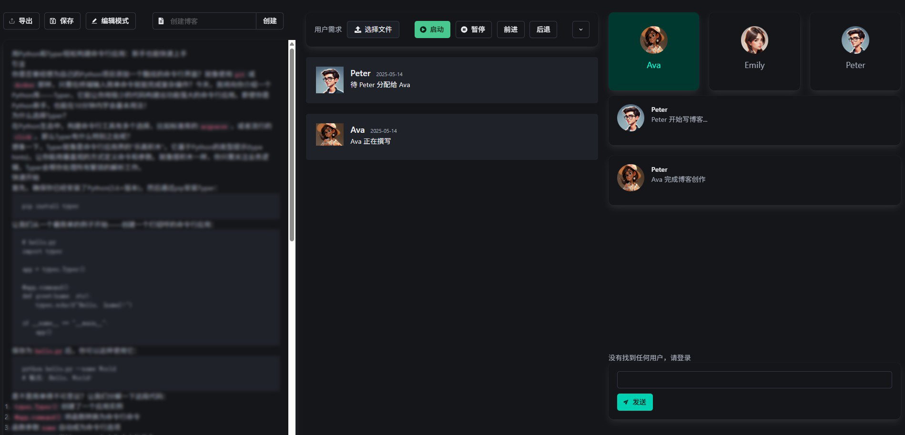

# aBlog(Beta版)

本项目是一个利用 Agent-based AI 技术实现自动化博客生成与优化的应用。旨在帮助用户更高效地创作和改进博客内容。


## ✨ 特性 (Features)

* **自动生成博客:** 根据用户输入的主题、关键词、目标受众等信息，智能生成全新的博客文章。
    
* **优化现有博客:** (计划/开发中) 提供功能帮助用户改进已有的博客内容，如调整语气、风格、增加关键词密度等。
    
* **用户友好界面:** (通过 React 实现) 提供直观的界面，方便用户提交需求和查看结果。
    



## 🚀 技术栈 (Technology Stack)

* **前端 (Frontend):**
    * React
    * React Hook Form (表单处理)
    * React Icons (图标)
    * 周边库 (如用于状态管理的 Context API 或其他库)
    * UI 框架 (基于代码片段中的类名，可能使用了 Bulma 或类似的 CSS 框架)
* **后端 (Backend):**
    * Python (作为主要开发语言)
    * FastAPI (提供高效的异步 API 接口)
    * Pydantic (用于数据模型定义和验证)
    * Agent-based AI 相关库 (具体依赖项取决于 AI 模型的实现细节)

## 🏗️ 架构概览 (Architecture Overview)

前端负责用户界面展示和用户交互，通过 API 调用与后端进行通信。后端接收前端请求，利用 Agent-based AI 逻辑处理博客生成/优化任务，并将结果返回给前端。


## 🛠️ 环境搭建 (Setup)

请确保你已经安装了 Node.js (包含 npm 或 yarn) 和 Python (推荐 3.9+)。

Please ensure you have Node.js (including npm or yarn) and Python (3.7+ recommended) installed.

1.  **克隆仓库 (Clone the repository):**

    ```bash
    git clone https://github.com/zideajang/react-tinybloghelper.git
    cd react-tinybloghelper
    ```


2.  **前端设置 (Frontend Setup):**

    ```bash
    npm install # 或 yarn install
    ```
    
    启动前端开发服务器：

    ```bash
    npm start # 或 yarn start
    ```

    前端应用通常会在 `http://localhost:3000` 启动。


## 🔌 API 说明 (API Documentation)

前端通过 `src/api/index.js` 文件中的函数调用与后端 API 交互。具体的接口实现逻辑请参考后端的源代码以及相关的视频说明。


## 📺 视频说明 (Video Explanations)

项目的后端逻辑实现等详细说明会更新到**哔哩哔哩 (Bilibili)** 频道。


请搜索用户：**zidea2015**


欢迎观看和交流！


## 👍 支持我们 (Support Us)

如果你喜欢这个项目，请给仓库一个 Star！⭐


欢迎提交 Issue 报告问题或提出建议。

---

希望这个 README 文件能帮助你更好地理解和运行项目！
